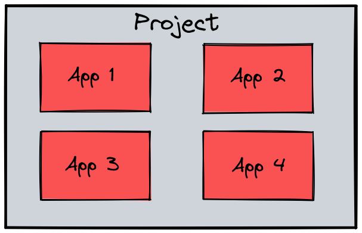
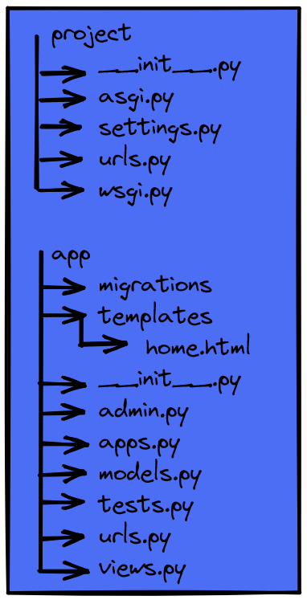

# Aplicaciones

Se crea el proyecto de Django

El proyecto se divide en aplicaciones, puede tener más de una aplicación. Al dividir el proyecto en aplicaciones es mucho más escalable y administrable el proyecto.



### Creación de aplicaciones


```
python .\manage.py startapp <name for app>
```

### Estructura de una aplicación

**views.py**: es donde se colocan las vistas de la aplicación.
**migratios**: es donde se guardan las configuraciones de las bases de datos, se guardarán los archivos de cada migración que se realize.
**admin.py**: el panel de administrador. 
**apps.py**: configuración de la aplicación, parecido al setting.py
**models.py**: es donde se crean clases que terminarán siendo las tablas de la base de dato.
**tests.py**: permite realizar tests de la aplicación.



