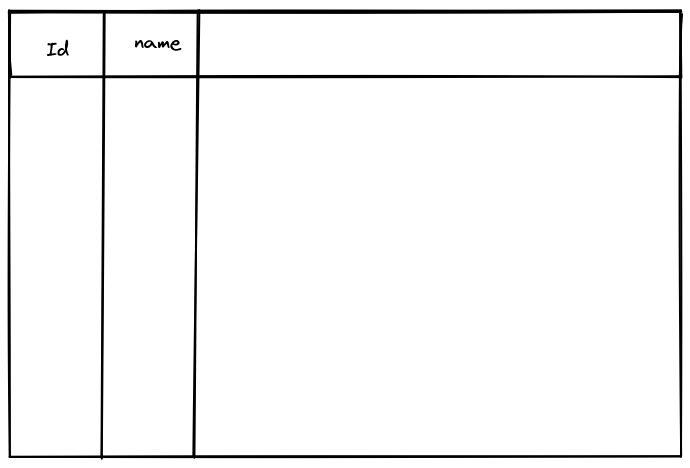
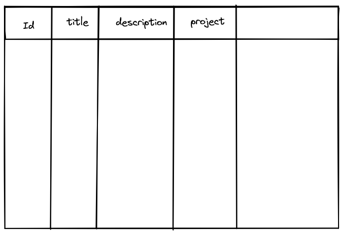

# Models

Los modelos son básicamente código que luego se refleja en creación de tablas SQL. Django ofrece un ORM que permite crear peticiones SQL con código de Python. 

Definir un modelo:
```python
from django.db import models

# Create table.
class Project(models.Model):
    # Create a column of the table.
    name = models.CharField(max_length=200)

class Task(models.Model):
    # Create a column of the table.
    title = models.CharField(max_length=200)
    description = models.TextField()
    project = models.ForeignKey(Project, on_delete=models.CASCADE)
```

Esto se refleja en la siguiente tabla:



### Migraciones 

Las tablas que uno crea luego debe realizar las peticiones a SQLite3, esto se llama migraciones. Las migraciones en Django se realizan por medio de comandos.

Este comando nos permite hacer las migraciones para actualizar la base de datos:
```
python manage.py makemigrations 
```

Realizamos las migraciones para efectuar los cambios:
```
python manage.py migrate
```

